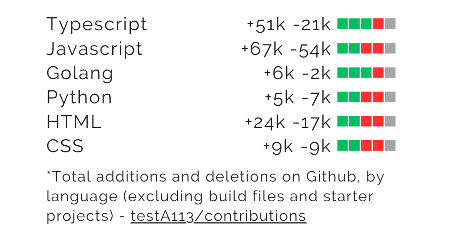

# LOC (Lines of Code) Calculation Script

This script calculates the total lines of code (LOC) additions and deletions by language for specified GitHub repositories and users. It uses the Octokit library to interact with the GitHub API.

Maybe you can use the output on your portfolio?


## Prerequisites

- Node.js and yarn installed
- A GitHub token stored in a .env file

## How It Works

1. Initializes Octokit with the GitHub token.
2. Fetches all commits for specified users in the given repositories.
3. Retrieves commit details for each commit, filtering out unnecessary files.
4. Aggregates LOC additions and deletions by language.
5. Saves the results in a loc-output.json file.

## Configuration

- Place your GitHub token in a .env file.
- Modify the constants.ts file to set commitSHAsToSkip, contributedRepos, filePathsToSkip, languageExtensionMap, and usernames.

## Running the Script

Execute the script using ts-node:

```sh
yarn && yarn start
```

The LOC data will be saved to loc-output.json in a format like the following:

```json
{
  "TypeScript": {
    "additions": 5000,
    "deletions": 2000
  },
  "JavaScript": {
    "additions": 1000,
    "deletions": 200
  },
  "Python": {
    "additions": 6000,
    "deletions": 3000
  }
}
```
